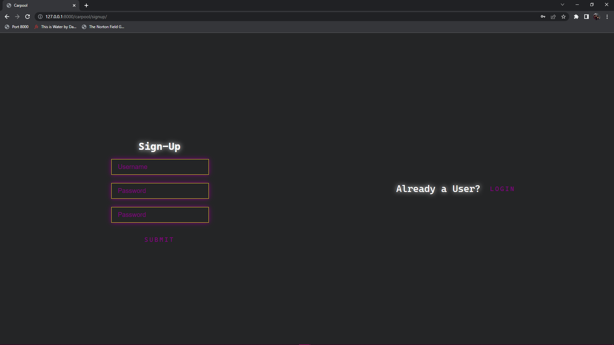
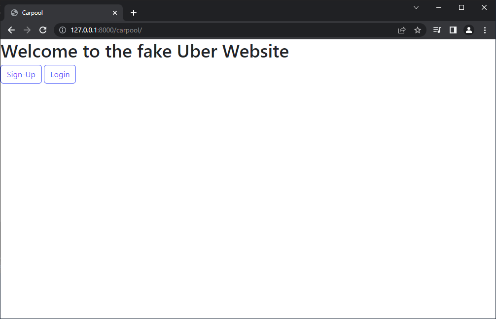
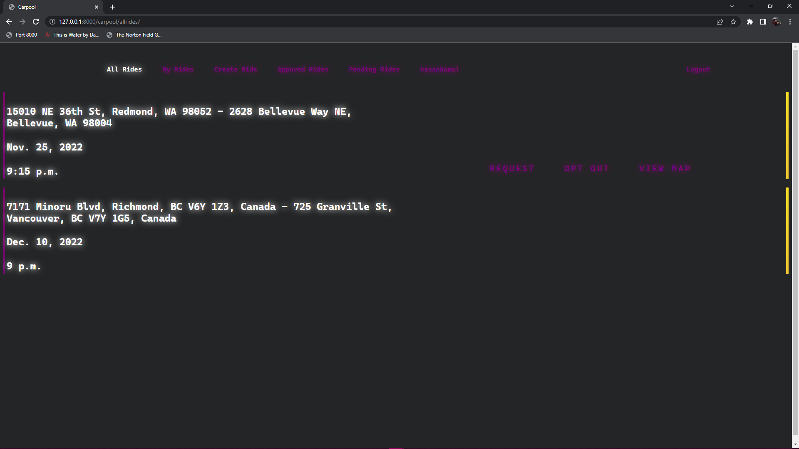
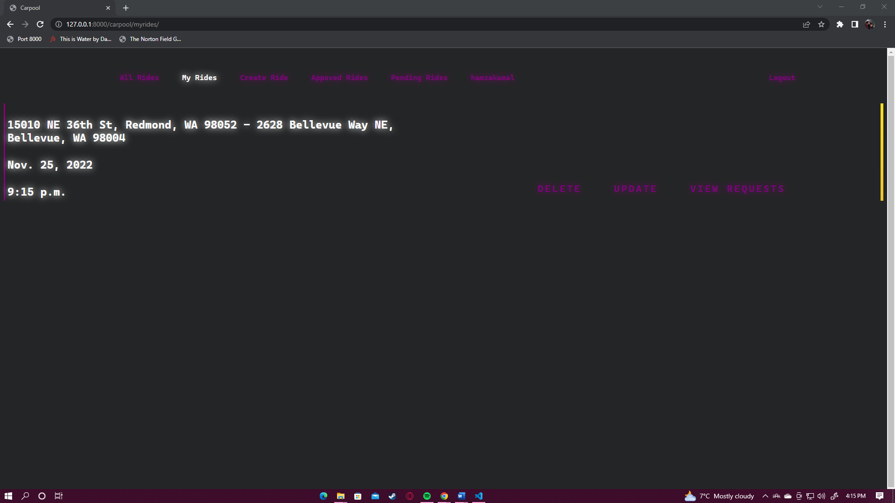
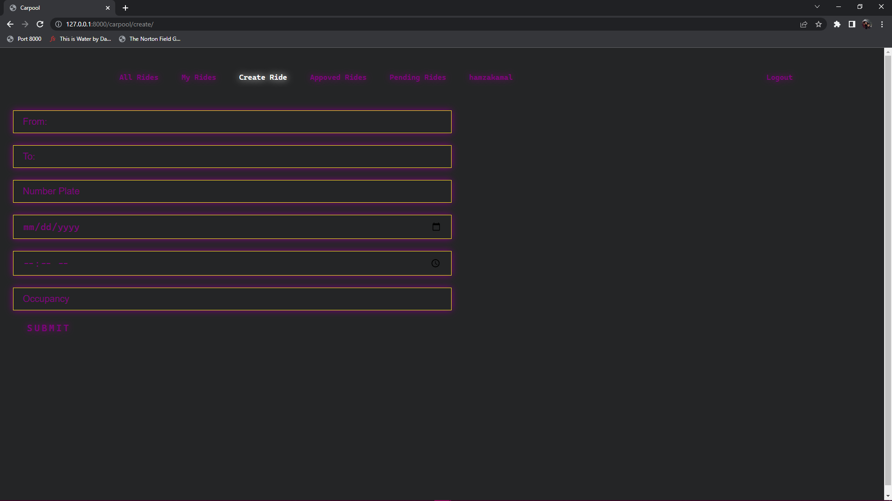
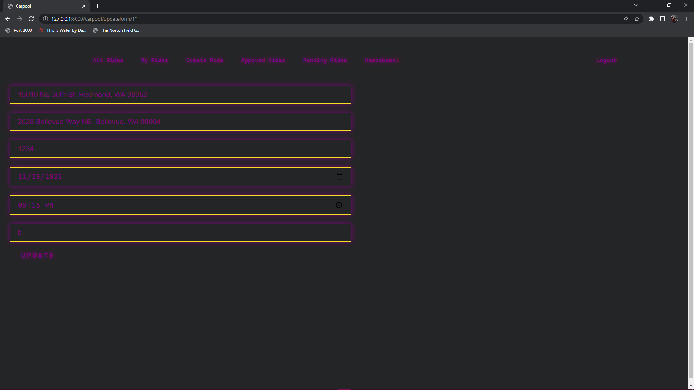
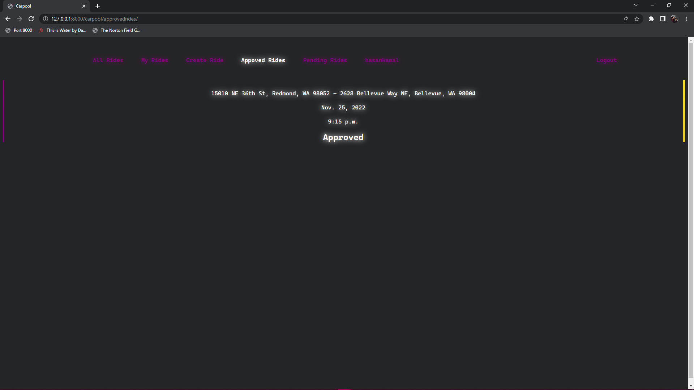
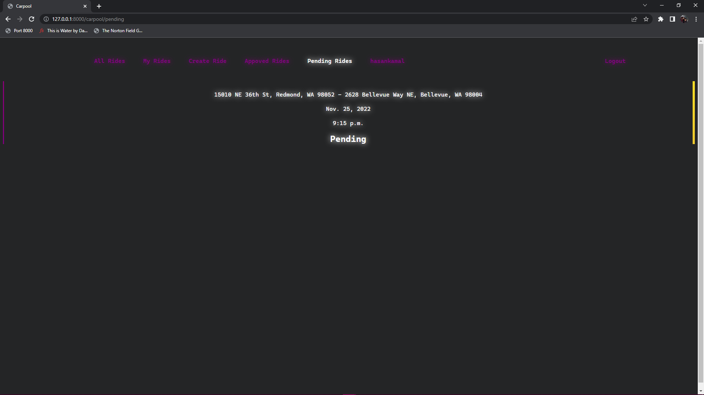
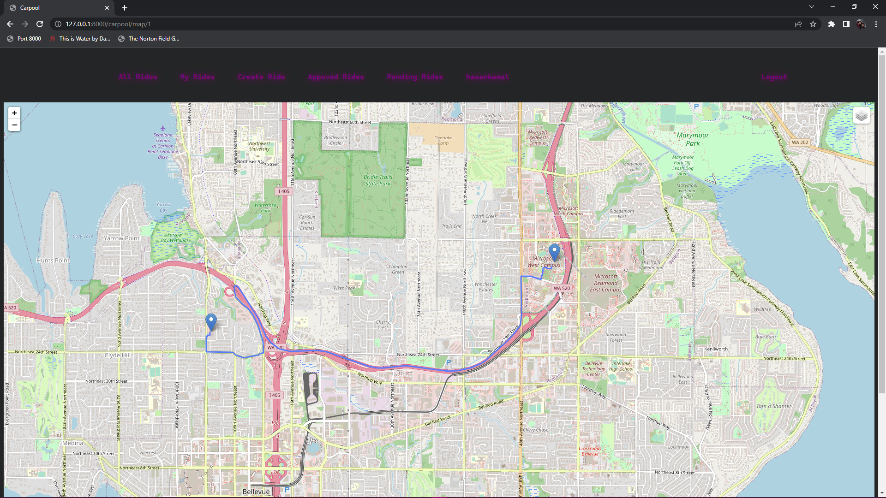

# Carpool
Carpool Website with Django

This web app is like Uber and can be used for carpooling, featues include: login, logout, create-ride, approval and denial flow, delete and update ride.

## Login:

## Sign-Up:

## Home:

## All Rides:

## My Rides:

## Create Ride:

## Update Ride:

## Ride Requests:

## Approved Ride:

## Pending Ride:

## Ride Map:

## Technologies used:
Django - 4.1.1.0
Python - 3.10.7
HTML - HTML5
