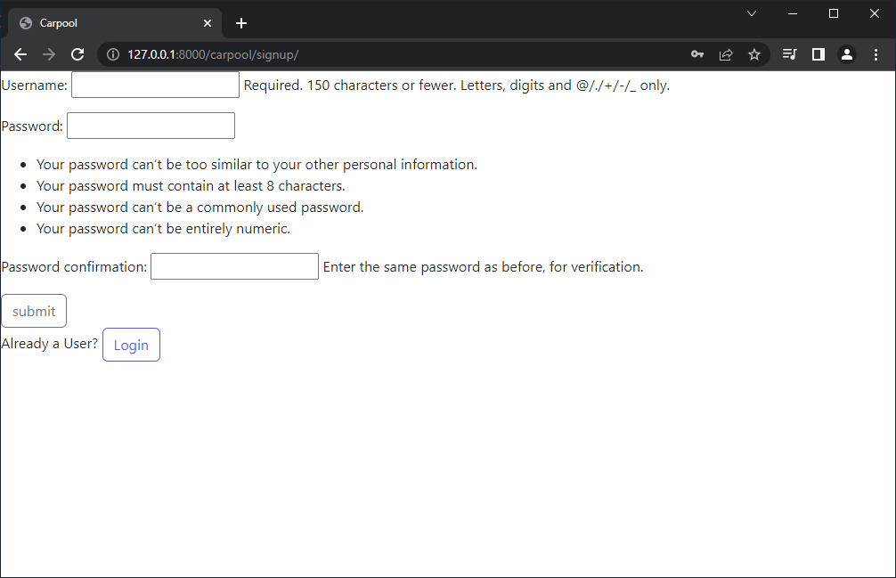
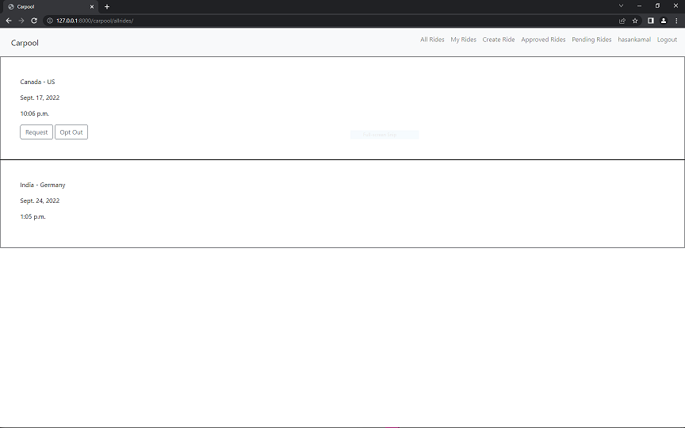
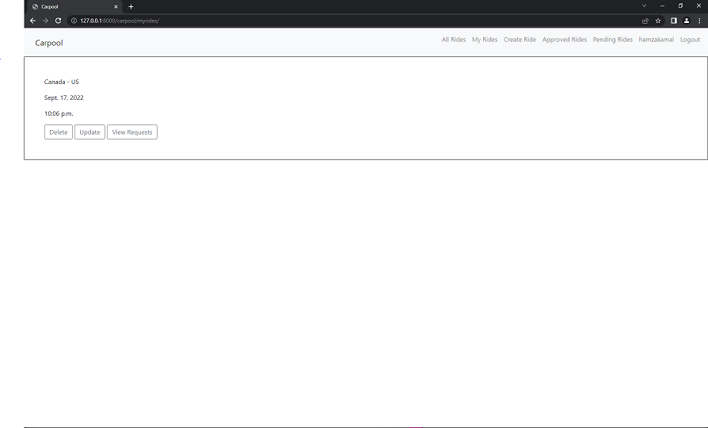
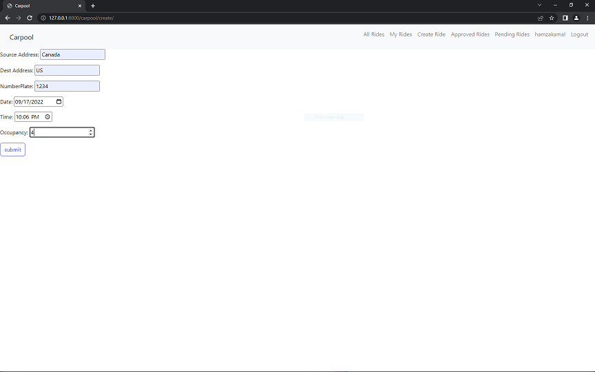
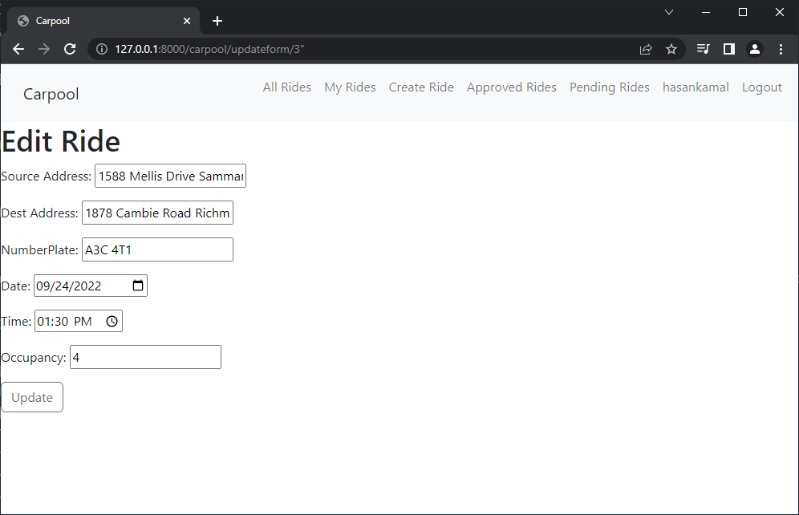
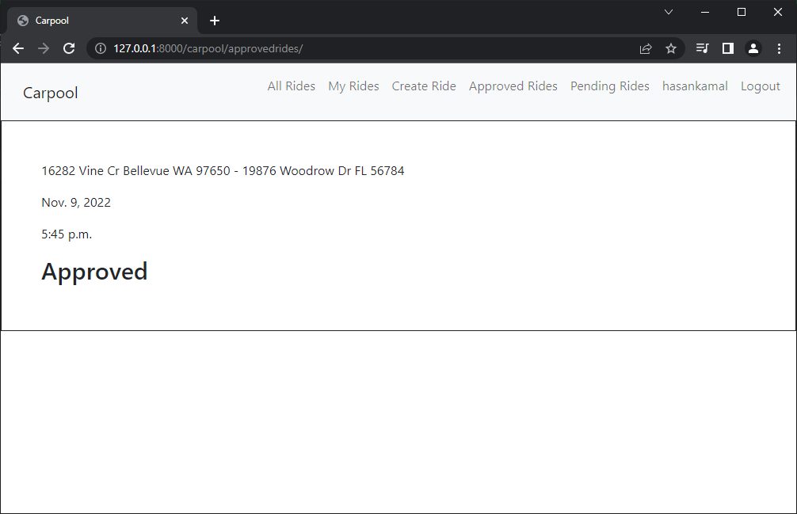
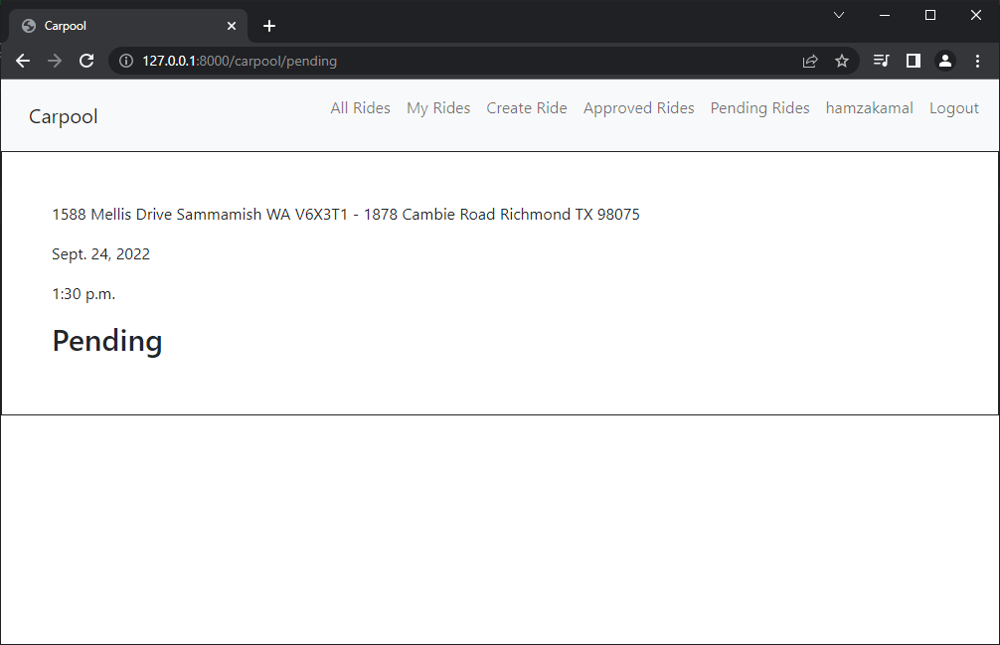

# Carpool
Carpool Website with Django

This web app is like Uber and can be used for carpooling, featues include: login, logout, create-ride, approval and denial flow, delete and update ride.

## Login:

## Sign-Up

## Home

## All Rides

## My Rides

## Create Ride

## Update Ride

## Ride Requests

## Approved Ride

## Pending Ride

